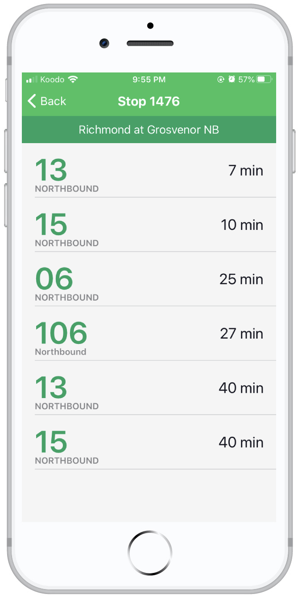

***Please Note: This application has not been updated in two years and so the version of Expo it runs on is now unsupported. The app is being rewritten in pure React Native (without Expo) to better support a potential App Store release. Other improvements are that the rewritten version will connect with the custom [transit_app_backend](https://github.com/gonzalez-chris/transit_app_backend) and that there will be numerous changes to the code structure and file organization.***

## Real-Time London Transit App

This app was created using [Expo](https://play.google.com/store/apps/details?id=host.exp.exponent). It has not yet been published to the Google Play Store or the Apple App Store. On an Android device, you can use this app by downloading [Expo Go](https://play.google.com/store/apps/details?id=host.exp.exponent) from the Google Play Store, and then clicking [here](https://expo.io/--/to-exp/exp%3A%2F%2Fexp.host%2F%40chris_g%2Flondontransitapp). Alternatively, you can scan the QR code at the bottom of the page once you have downloaded Expo Go. Due to Apple's terms of service, it is not currently possible to run this app on an external iOS device.

### Screenshots

### Android QR Code

